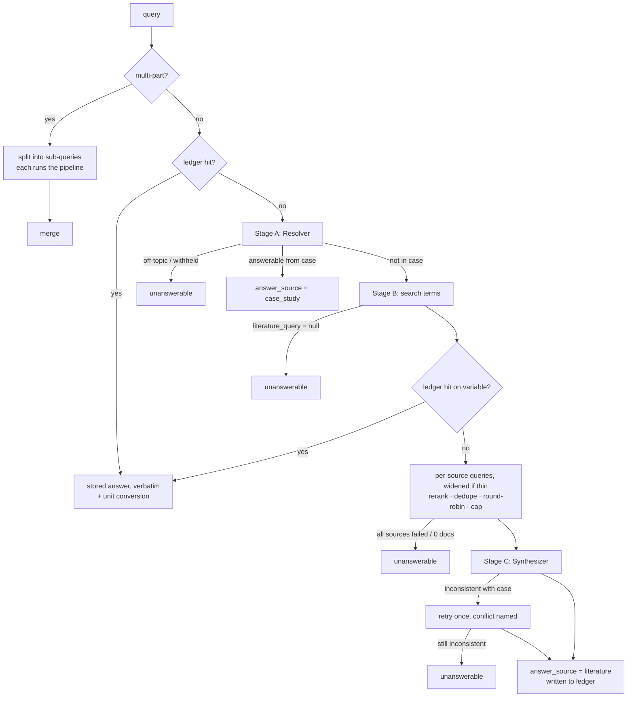

# medsim

A simulated, text-only patient encounter for evaluating diagnostic agents. You ask a
natural-language question about a patient. `medsim` answers from a fixed case study. When the case
study is silent, it synthesizes a plausible answer from biomedical literature (Europe PMC and
LitSense 2.0) using an LLM served by OpenRouter.

> [!WARNING]
> **Synthesized answers are simulation artifacts, not clinical claims.** Any response with
> `answer_source: "literature"` is a plausible synthetic value produced for evaluation purposes.
> Do not use `medsim` output for patient care or as medical evidence.

---

## Install

Requires Python 3.11+.

```bash
uv venv --python 3.11 .venv && uv pip install -e ".[dev]"
```

or with plain pip:

```bash
python -m venv .venv && .venv/bin/pip install -e ".[dev]"
```

## Secrets and configuration

```bash
cp .env.example .env
```

Set `OPENROUTER_API_KEY` (required). Also set `MEDSIM_CONTACT_EMAIL`, which goes into the
User-Agent sent to Europe PMC and LitSense. If the key is missing, construction fails immediately
with an actionable `ConfigError`. `.env` is git-ignored, and the key is redacted from exceptions
and logs.

All tunables live in `medsim.config.Settings` and are read from the environment with the prefix
`MEDSIM_`. Nested retriever settings use `__`. Common ones:

| Variable | Default | Meaning |
|---|---|---|
| `MEDSIM_DEFAULT_MODEL` | `deepseek/deepseek-v4-flash-0731` | Model for all stages |
| `MEDSIM_RESOLVER_MODEL` / `_QUERY_BUILDER_MODEL` / `_SYNTHESIZER_MODEL` | unset | Per-stage override |
| `MEDSIM_SYNTHESIZER_TEMPERATURE` | `0.2` | Stages A and B always use `0` |
| `MEDSIM_SEED` | `7` | Sent when the model supports `seed` |
| `MEDSIM_JSON_MODE` | `json_schema` | `json_schema`, `json_object`, or `none` (auto-downgraded per model) |
| `MEDSIM_RESOLVER_MAX_TOKENS` / `_QUERY_BUILDER_MAX_TOKENS` / `_SYNTHESIZER_MAX_TOKENS` | `4000` / `4000` / `6000` | Completion budgets, including reasoning tokens; a cut-off reply is retried once with double the budget |
| `MEDSIM_ENABLED_SOURCES` | `["europe_pmc","litsense"]` | Literature sources |
| `MEDSIM_MAX_DOCUMENTS` / `MEDSIM_MAX_DOC_CHARS` | `8` / `1500` | Context caps after merge |
| `MEDSIM_EUROPE_PMC__PAGE_SIZE`, `__RESULT_TYPE`, `__OPEN_ACCESS_ONLY`, `__FULL_TEXT_ONLY`, `__SORT`, `__SYNONYM` | `25`, `core`, `false`, `false`, unset, `false` | Europe PMC search (page size is the candidate pool before reranking) |
| `MEDSIM_LITSENSE__MODE`, `__RERANK`, `__MAX_RESULTS` | `passages`, `true`, `30` | LitSense search (max results is the candidate pool before reranking) |
| `MEDSIM_RERANK_DOCUMENTS` | `true` | Rank each source's documents by variable/condition term matches before merging |
| `MEDSIM_RELAX_MIN_RELEVANT` | `3` | Broaden a source's query while fewer documents than this mention the variable |
| `MEDSIM_CACHE_ENABLED` / `MEDSIM_CACHE_DIR` | `false` / `.medsim_cache` | On-disk retrieval cache for reproducible reruns |
| `MEDSIM_RANK_FOR_VALUES`, `MEDSIM_MERGE_STRATEGY` | `false`, `round_robin` | Retrieval change 1: documents stating a value rank first; `global` ranks all sources in one list |
| `MEDSIM_POPULATION_FILTER` | `false` | Change 2: drop animal studies (MeSH, LitSense species tags, title); rank other age groups lower |
| `MEDSIM_LADDER_VERSION`, `MEDSIM_FULLTEXT_EXCERPTS`, `MEDSIM_FULLTEXT_MAX_DOCS` | `v1`, `false`, `10` | Changes 3–4: `v2` adds a Europe PMC article-body search (`CASE`/`RESULTS`/`TABLE`) and drops unhelpful fallback rungs; excerpts keep the sentences about the variable, from open-access full text where available |
| `MEDSIM_LITSENSE__QUERY_STYLE` | `keywords` | Change 5: `natural` sends "serum albumin in patients with biloma" |
| `MEDSIM_LLM_RERANK`, `MEDSIM_RERANKER_MODEL`, `MEDSIM_RERANK_CANDIDATES` | `false`, default model, `20` | Change 6: an LLM picks the final documents from the best candidates |
| `MEDSIM_OPENROUTER_SEARCH__ENGINE`, `__MAX_RESULTS`, `__MAX_CHARACTERS`, `__ALLOWED_DOMAINS`, `__MODEL` | `exa`, `8`, `1500`, NCBI/Europe PMC/MSD Manuals/Medscape, default model | OpenRouter web search source (only used when `openrouter_search` is in `MEDSIM_ENABLED_SOURCES`) |
| `MEDSIM_VERIFY_MODELS_ON_STARTUP` | `true` | Check model slugs against OpenRouter `/models` |

## Quick start

A case study is a JSON file matching `CaseStudy`:

```json
{
  "case_id": "…",
  "diagnosis": "ground-truth diagnosis (conditions retrieval; never revealed)",
  "narrative": "free-text case description",
  "structured_findings": {"optional": "pre-extracted facts"},
  "metadata": {}
}
```

```python
from medsim import MedicalEnvironment

env = MedicalEnvironment.from_case_file("cases/example_case.json")
response = env.query("What is the patient's temperature?")
print(response.output_answer, response.answer_source)
```

You can also inject every collaborator yourself:

```python
env = MedicalEnvironment(case_study=case, llm=my_llm, retrievers=[my_retriever], settings=settings)
```

CLI:

```bash
python -m medsim --case cases/example_case.json --query "What is the patient's temperature?"
```

```bash
printf "What is the temperature on day 3?\nWhat is the temperature on day 3 in Fahrenheit?\n" | python -m medsim --case cases/example_case.json --json --save-ledger session.json
```

- **Input:** with no `--query`, questions are read from stdin, one per line, and share one
  ledger.
- **Output:** `--json` prints the full `EnvironmentResponse`, one object per line in batch mode.
  `--verbose` adds debug logs, the retrieved documents, and the retriever parameters.
- **Sessions:** `--load-ledger` resumes a saved session.

## How a query is answered



Each stage makes one LLM call when all goes well. Every call requests strict JSON through
`response_format` and is validated with Pydantic. Two bounded recoveries exist: one retry with
double `max_tokens` if the reply was cut off by the token limit (reasoning models can spend the
whole budget before answering), and one repair request if the JSON is invalid.

### How literature queries are written

Stage B does not write query syntax. It returns the search terms: `variable_terms` (the variable
and its synonyms), `condition_terms` (the diagnosis and its synonyms), `related_condition_terms`
(broader or closely related conditions), and `context_terms` (for example "elderly" or
"postoperative"). `medsim/retrieval/query_formulation.py` turns them into a query per source:

- **Europe PMC:** `TITLE_ABS:(variable synonyms) AND TITLE_ABS:(condition synonyms)`, so every
  hit mentions both in its title or abstract.
- **LitSense:** a short `"<variable> <condition>"` phrase, which suits its word-overlap prefilter
  and semantic reranker.

If fewer than `MEDSIM_RELAX_MIN_RELEVANT` documents mention the variable, that source moves down a
ladder of broader queries: related conditions, then any field, then reference ranges. Results
from every attempt are kept. Each source's documents are then reranked by term matches (variable,
condition, and a nearby number for numeric questions) before the round-robin merge. Every attempt
is recorded in `retriever_parameters.per_source.<source>.query_attempts`. See NOTES.md for the
measurements behind these choices.

### Path 1: the case study answers

Case narrative: *"…At presentation her temperature was 37.9 °C and her blood pressure was
118/76 mmHg…"*

```text
Q: What was her blood pressure at presentation?
A: Her blood pressure at presentation was 118/76 mmHg.
   source: case_study | confidence: high
   evidence: At presentation her temperature was 37.9 °C and her blood pressure was 118/76 mmHg.
   llm calls: resolver/initial deepseek/deepseek-v4-flash-0731 1450->85 tok 1.0s
```

```json
{
  "input_query": "What was her blood pressure at presentation?",
  "output_answer": "Her blood pressure at presentation was 118/76 mmHg.",
  "literature_search": false,
  "literature_search_result": null,
  "retriever_parameters": {
    "multi_part": false,
    "query": "What was her blood pressure at presentation?",
    "path": "case_study",
    "retrieval_performed": false
  },
  "used_llm": "deepseek/deepseek-v4-flash-0731",
  "answer_source": "case_study",
  "evidence": [
    "At presentation her temperature was 37.9 °C and her blood pressure was 118/76 mmHg."
  ],
  "confidence": "high",
  "llm_calls": [
    {"stage": "resolver", "model": "deepseek/deepseek-v4-flash-0731", "prompt_tokens": 1450,
     "completion_tokens": 85, "latency_ms": 950.0, "attempt": 1, "purpose": "initial",
     "success": true, "error": null, "finish_reason": "stop", "max_tokens": 4000}
  ]
}
```

### Path 2: the case is silent, so the answer is synthesized from literature

The case gives only the temperature at presentation, and the question asks about day 4.

1. **Stage A** reports the question as not answerable from the case. It passes
   `"At presentation her temperature was 37.9 °C"` along as a partial fact.
2. **Stage B** returns search terms: variable `["body temperature", "fever"]`, condition
   `["common cold", "upper respiratory tract infection"]`, related condition
   `["viral respiratory infection"]`, context `["adults"]`. It also returns a fallback keyword
   query.
3. **Retrieval** sends Europe PMC
   `TITLE_ABS:("body temperature" OR fever) AND TITLE_ABS:("common cold" OR "upper respiratory tract infection")`
   and LitSense `body temperature common cold`. Both returned enough documents mentioning the
   variable on the first attempt. The documents are reranked, deduped, interleaved, and capped.
4. **Stage C** turns the literature range into one concrete patient value that is consistent with
   the case.

```text
Q: What is the patient's temperature on day 4?
A: Temperature on day 4 is 37.4 °C.
   source: literature (SYNTHESIZED — simulation artifact, not a clinical claim) | confidence: medium
   evidence: PMID:42016338; literature range: 36.1-37.2 °C normal; low-grade fever above 37.2 °C (PMID:42016338)
   literature query: "europe_pmc: TITLE_ABS:("body temperature" OR fever) AND TITLE_ABS:("common cold" OR "upper respiratory tract infection") | litsense: body temperature common cold" -> 4 docs (europe_pmc=2, litsense=2)
   llm calls: resolver/initial …; query_builder/initial …; synthesizer/initial …
```

Abbreviated JSON (document list, per-source settings, and `llm_calls` are shortened here):

```json
{
  "input_query": "What is the patient's temperature on day 4?",
  "output_answer": "Temperature on day 4 is 37.4 °C.",
  "literature_search": true,
  "literature_search_result": {
    "query": "europe_pmc: TITLE_ABS:(\"body temperature\" OR fever) AND TITLE_ABS:(\"common cold\" OR \"upper respiratory tract infection\") | litsense: body temperature common cold",
    "documents": [
      {"source": "europe_pmc", "doc_id": "PMID:42016338",
       "title": "Approach to Low Body Temperature or Mild Hypothermia in the Geriatric Population: A Narrative Review.",
       "text": "While normal human body temperature is often cited as 36.1-37.2 °C, …",
       "url": "https://pubmed.ncbi.nlm.nih.gov/42016338/", "score": null, "raw": {"…": "unmodified record"}},
      {"…": "3 more documents: PMID:15966382#TITLEABSTRACT-cd5ba1a3, PMID:42493760, PMID:25786400#RESULTS-1fdd41e6"}
    ],
    "per_source_counts": {"europe_pmc": 2, "litsense": 2},
    "errors": [],
    "latency_ms": 1834.2
  },
  "retriever_parameters": {
    "multi_part": false,
    "query": "What is the patient's temperature on day 4?",
    "path": "literature",
    "retrieval_performed": true,
    "literature_query": "body temperature fever common cold adults",
    "sources": ["europe_pmc", "litsense"],
    "max_documents": 4,
    "max_doc_chars": 240,
    "dedupe": {"by_identifier": true, "near_duplicate_text_jaccard": 0.9},
    "query_formulation": {"strategy": "source-specific relaxation ladder", "relax_until_relevant_docs": 3},
    "ranking": "lexical term rerank within each source, then round-robin interleave",
    "per_source": {
      "europe_pmc": {
        "endpoint": "https://www.ebi.ac.uk/europepmc/webservices/rest/search",
        "request_params": {"query": "TITLE_ABS:(\"body temperature\" OR fever) AND TITLE_ABS:(\"common cold\" OR \"upper respiratory tract infection\")",
                           "resultType": "core", "pageSize": "25", "format": "json",
                           "synonym": "false", "cursorMark": "*"},
        "page_size": 25, "result_type": "core", "…": "timeouts, retries, filters, cache",
        "query_attempts": [
          {"level": "variable_and_condition", "query": "TITLE_ABS:(\"body temperature\" OR fever) AND TITLE_ABS:(\"common cold\" OR \"upper respiratory tract infection\")",
           "returned": 5, "new": 5, "relevant_total": 3}
        ]
      },
      "litsense": {
        "endpoint": "https://www.ncbi.nlm.nih.gov/research/litsense2-api/api/passages/",
        "request_params": {"query": "body temperature common cold", "rerank": "true"},
        "result_type": "passages", "max_results": 30, "…": "timeouts, retries, cache",
        "query_attempts": [
          {"level": "variable_and_condition", "query": "body temperature common cold",
           "returned": 30, "new": 30, "relevant_total": 28}
        ]
      }
    },
    "raw_counts": {"europe_pmc": 5, "litsense": 30},
    "failed_sources": []
  },
  "used_llm": "deepseek/deepseek-v4-flash-0731",
  "answer_source": "literature",
  "evidence": [
    "PMID:42016338",
    "literature range: 36.1-37.2 °C normal; low-grade fever above 37.2 °C (PMID:42016338)"
  ],
  "confidence": "medium",
  "llm_calls": [
    {"stage": "resolver", "purpose": "initial", "…": "…"},
    {"stage": "query_builder", "purpose": "initial", "…": "…"},
    {"stage": "synthesizer", "purpose": "initial", "…": "…"}
  ]
}
```

*These samples were produced offline from recorded Europe PMC and LitSense responses and scripted
LLM outputs. Token counts and latencies are illustrative; documents and settings are
abbreviated.*

## Output schema: `EnvironmentResponse`

| Field | Type | Meaning |
|---|---|---|
| `input_query` | `str` | The question as received |
| `output_answer` | `str` | The answer; the only field an agent under evaluation should see (see below) |
| `literature_search` | `bool` | Whether retrieval ran for this call |
| `literature_search_result` | `LiteratureSearchResult \| null` | `query` actually sent (one string, or `europe_pmc: … \| litsense: …` when sources got different queries; the last attempt per source), `documents` (`source, doc_id, title, text, url, score, raw`), `per_source_counts` (after merge), `errors` (non-fatal source failures), `latency_ms` |
| `retriever_parameters` | `object` | What was actually used for this call. Includes `path`, `literature_query` (Stage B fallback keywords), `sources`, caps, dedupe, `query_formulation` and ranking settings, `per_source` (endpoint, exact request params of the last attempt, timeouts, retries, filters, cache hit, `query_attempts`), `raw_counts`, `failed_sources`. Multi-part queries: `{"multi_part": true, "sub_queries": [...]}` |
| `used_llm` | `str` | Model(s) that served the LLM calls |
| `answer_source` | `case_study \| literature \| unanswerable` | `literature` means **synthesized** |
| `evidence` | `list[str]` | Case-study spans, or supporting doc ids plus the source literature range; `ledger:<key>` on repeats |
| `confidence` | `high \| medium \| low` | Case-study answers are `high`; uncited synthesized answers are `low` |
| `llm_calls` | `list[LLMCallRecord]` | `stage, model, prompt_tokens, completion_tokens, latency_ms, attempt, purpose (initial/json_repair/consistency_retry/length_retry), success, error, finish_reason, max_tokens, cost_usd` (OpenRouter's `usage.cost`) |

> [!IMPORTANT]
> **What agents should see.** The diagnosis is visible to the LLM stages, and the prompts forbid
> revealing it. However, Stage B uses it to build the literature queries, so
> `literature_search_result`, `retriever_parameters`, and the documents can reveal it. Give a
> diagnostic agent **only `output_answer`**. The full response is for evaluators.

## Consistency guarantees

- **Case consistency.** Stage C receives the case study, the partial facts, and the established
  facts, and must not contradict them. If it reports `consistent_with_case: false`, it is retried
  once with the conflict named. If the retry also fails, the result is `unanswerable`.
- **Concrete values.** The answer states a patient value such as "Temperature is 38.1 °C". A range
  from the literature is recorded in `evidence`.
- **Cross-query coherence.** `FactLedger` stores every answered fact as
  `(case_id, clinical_variable, value, unit, source_doc_ids)`. Facts are scoped by the case id and
  keyed by `variable@timepoint` within a case. A question is a ledger hit only when it matches a
  fact recorded for the same case id, so one ledger can be shared or reloaded across cases
  safely. Only the current case's established facts are injected into the Stage A and Stage C
  prompts.
  - A repeated question returns the stored answer verbatim with no LLM call.
  - A different unit is converted deterministically: *"Temperature is 37.0 °C. (98.6 °F)"*.
  - Repeats are detected by rules (see `medsim/rules.py`), and again after Stage B using its
    `clinical_variable`.
- **Session control.** `env.reset()` clears the ledger facts for the environment's own case
  (`ledger.reset()` with no argument clears every case). `env.ledger.save(path)` and
  `FactLedger.load(path)` persist a session. Ledger files use format version 2; version-1
  files, which have no case ids, are rejected.

## Edge cases

| Situation | Behaviour |
|---|---|
| Not about the patient ("what model are you?") | `unanswerable` after Stage A only; no retrieval |
| Asks for the diagnosis | `unanswerable` ("withheld") after Stage A only |
| Case partially answers (admission value, question asks day 3) | Retrieval runs; the partial fact is passed to Stages B and C as a constraint |
| No meaningful literature answer (name, insurance) | Stage B returns `literature_query: null`, giving `unanswerable` |
| Few documents mention the variable | That source's query is broadened step by step; every attempt is recorded |
| Zero documents / every source failed | `literature_search: true`, empty `documents`, `unanswerable` |
| One source fails | Its error is logged to `errors`; the other source is used |
| "temperature and heart rate" | Split into sub-queries, each resolved separately, then merged |
| Reply cut off by `max_tokens` | Retried once with double the budget; raises `LLMTruncatedError` (naming the setting to raise) if cut off again |
| LLM transport failure / JSON invalid after repair | Raises `LLMError` / `LLMResponseError` (never disguised as an answer) |

## Adding a retriever

1. Implement the `medsim.retrieval.Retriever` protocol:

   ```python
   class MyRetriever:
       name = "my_source"
       def search(self, query: str, **params: Any) -> list[RetrievedDocument]: ...
       def parameters(self) -> dict[str, Any]: ...  # params actually used by the last search
   ```

   Raise `RetrieverError(self.name, "...")` for failures; the aggregator records it and continues.
   Use `medsim.http_utils.request_with_retries` for backoff on 429/5xx.
2. Add the source name to `SourceName` in `medsim/models.py`. `RetrievedDocument.source` is a
   `Literal`.
3. Optionally give it source-specific queries. Register a function in
   `medsim.retrieval.query_formulation.LADDERS` that maps a `LiteratureQuery` to a list of
   `QueryAttempt`s, strictest first. Without one, the source receives Stage B's fallback keyword
   query, and its documents are still reranked.
4. Either pass it directly with `MedicalEnvironment(..., retrievers=[...])`, or add a settings
   block in `config.py` and a branch in `environment.build_retrievers`.
5. Add fixture-replay tests with `respx`.

### Built-in optional source: OpenRouter web search

`openrouter_search` (`medsim/retrieval/openrouter_search.py`) uses OpenRouter's
`openrouter:web_search` server tool. A small model (the default model unless
`MEDSIM_OPENROUTER_SEARCH__MODEL` is set) is asked to run exactly one search; OpenRouter runs it
with the configured engine (Exa by default, limited to medical domains) and returns every result
as a `url_citation` annotation with an excerpt. Each search costs the engine fee (Exa: $0.007 per
request with up to 10 results) plus the model's tokens; the cost is reported per attempt as
`retriever_parameters.per_source.openrouter_search.query_attempts[].cost_usd`. It gets one natural
language query ("total bilirubin in elderly patients with tricuspid regurgitation") and no
relaxation ladder, because every search is billed. Enable it with
`MEDSIM_ENABLED_SOURCES='["openrouter_search"]'` (alone or next to the other sources).

### Retrieval changes 1–6

Six optional changes to the Europe PMC + LitSense retrieval, each behind a setting above and off by
default so the original method stays reproducible. They were designed from the benchmark's
failure analysis and measured with it; see [results/README.md](results/README.md) for the
evidence and the results. Implementation: `medsim/retrieval/aggregator.py` (steps),
`query_formulation.py` (ladders, scoring, excerpts), `population.py`, `fulltext.py`,
`rerank.py`.

## Retrieval benchmark

`bench/` measures whether retrieved documents are relevant, useful, and correct with an LLM judge,
and compares retrieval methods, including cost. See [bench/README.md](bench/README.md) and the
results in [results/](results/).

## Swapping the model

Set `MEDSIM_DEFAULT_MODEL` to any OpenRouter slug, or override one stage with
`MEDSIM_SYNTHESIZER_MODEL` and similar. At startup every stage's model is checked against
OpenRouter's `/models` endpoint. An unknown slug fails fast and lists close matches.

The client reads each model's `supported_parameters`:
- It sends a strict `json_schema` response format when `structured_outputs` is supported.
- It falls back to `json_object`, or to prompt-only JSON, when it isn't.
- It sends `seed` only when supported.

Reasoning models count thinking toward `max_tokens`. If `llm_calls` show `length_retry` entries,
raise the stage's `MEDSIM_*_MAX_TOKENS`. Extra request fields such as provider routing can go in
`MEDSIM_LLM_EXTRA_BODY` (JSON). Any other backend works if it implements the
`medsim.llm.LLMClient` protocol and is injected.

## Tests

```bash
.venv/bin/pytest
```

- **Offline by default.** No test touches the network. Europe PMC, LitSense, and OpenRouter
  `/models` replay responses recorded into `tests/fixtures/`, and LLM outputs are scripted.
- **Live test.** One integration test is marked `live` and runs only with a key:

```bash
OPENROUTER_API_KEY=sk-... .venv/bin/pytest --live -m live
```

```bash
.venv/bin/mypy && .venv/bin/ruff check medsim tests
```

See [NOTES.md](NOTES.md) for every assumption, the endpoint verification record, and what could
not be confirmed.
