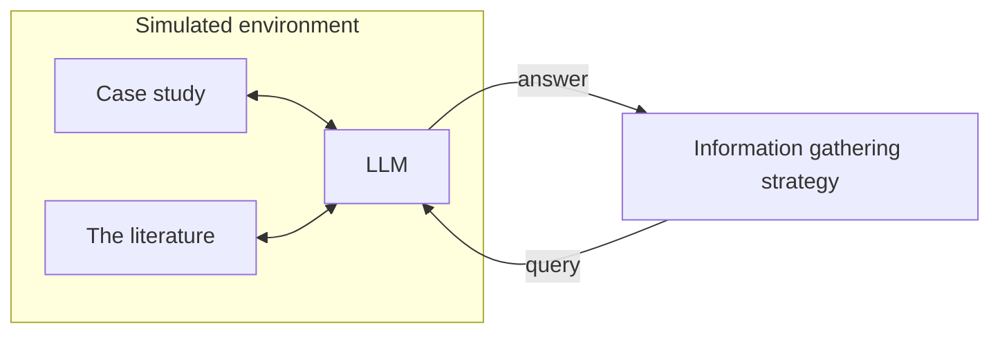

# ICS experiment

Compares **information collection strategies** on simulated patients. A strategy is an agentic
system that asks questions about a patient with an LLM. The simulated environment answers each
question from the patient's case study or, when the case is silent, synthesizes a plausible
answer from the biomedical literature. The answers accumulate in the strategy's memory until a
stopping criterion is reached.



> [!WARNING]
> Answers with `answer_source: "literature"` are synthesized simulation artifacts, not clinical
> claims. See [environment/README.md](environment/README.md).

## Layout

```text
.
├── run_webapp.command      double-click to start the web app (macOS)
├── README.md               this file
├── pyproject.toml          one package set: environment + experiment
├── .env.example            copy to .env and add OPENROUTER_API_KEY
├── cases/                  case datasets (shared by the experiment and the environment)
├── configs/                experiment configs; basic.json uses the "basic" strategy
├── experiment/             the experiment: config, runner (threads), progress, records, CLI
├── strategies/             information gathering strategies: base interface, basic
├── webapp/                 web app: server, stored-run loader, static page
├── scripts/                run_experiment.py
├── records/                experiment records (one JSON file per run)
├── environment/            the simulated environment, as before the restructure
│   ├── README.md, NOTES.md how it answers, its settings, verification notes
│   ├── medsim/             the environment package
│   ├── bench/              its retrieval benchmark
│   ├── results/            the benchmark's results
│   └── runs/               recorded live checks of the environment
└── tests/
    ├── conftest.py, fixtures/   shared test doubles and recorded API responses
    ├── environment/        environment and benchmark tests
    └── experiment/         experiment, strategy, CLI, and web app tests
```

The Python packages keep their names (`medsim`, `bench`, `experiment`, `strategies`,
`webapp`); `pyproject.toml` installs the two under `environment/` as top-level packages.

## Install

Requires Python 3.11+.

```bash
uv venv --python 3.11 .venv && uv pip install -e ".[dev]"
```

```bash
cp .env.example .env
```

Add your `OPENROUTER_API_KEY` to `.env` (and optionally `MEDSIM_CONTACT_EMAIL`).
`run_webapp.command` does the install itself on first launch if `.venv` is missing or stale.

## Run an experiment

From the command line:

```bash
.venv/bin/python scripts/run_experiment.py --config configs/basic.json
```

Options override the config for a quick trial, for example
`--max-cases 2 --max-iterations 3 --workers 2`; `--help` lists them. On a terminal it shows a
live progress bar and a line per finished case run, then the record's path.

Or double-click **`run_webapp.command`** in Finder (or run `.venv/bin/python -m webapp`). It opens
the web app in your browser at `http://127.0.0.1:8765/`.

### What a run does

1. The config names a case dataset (`cases_file`) and optionally which cases (`case_ids`,
   `max_cases`).
2. Every selected case is run with every strategy in the config. One (case, strategy) pair is a
   **case run**.
3. A case run loads the case into a fresh environment: its own fact ledger and retrievers.
4. The strategy asks a question, the environment answers, and the answer is stored in the
   strategy's memory for this case run. Each question and answer is an **iteration**. The
   strategy sees only `output_answer`, never the retrieval details that could reveal the
   diagnosis.
5. The case run stops at whichever limit it reaches first: `max_iterations`, or `max_seconds`
   since it started. The time limit is checked before each iteration, so the question in
   progress when time runs out is allowed to finish. The finished case run is then saved.
   `configs/basic.json` sets no time limit: its default model runs through OpenRouter's Batch
   API, where each LLM call waits for an asynchronous batch (see
   [environment/README.md](environment/README.md#batch-api)), so elapsed time says little.
6. Case runs are independent, so they run in parallel threads (`workers`). Iterations inside a
   case run are sequential, because each question depends on the answers before it. With
   `workers: 1` the cases run strictly one after another. All threads share one LLM client,
   one HTTP client, the retrieval cache, and LitSense's rate limit of one request per second.
7. When every case run has finished, the experiment record is saved.

Each finished case run is appended to `<record>.partial.jsonl` as it completes, so a crash or
Ctrl+C loses only the case runs still in progress. The final `<record>.json` replaces it.
Stopping a run (Ctrl+C, or Stop in the web app) saves the finished case runs with status
`cancelled`.

**Time and cost.** In a live trial with the default model (2 cases × 3 iterations), questions
answered from the case took 5–15 s. Questions that needed the literature took 1–2 minutes,
mostly model reasoning time. That trial cost $0.0031 in total. `configs/basic.json` (5 cases ×
8 iterations, 5 in parallel) should take roughly 10–15 minutes.

### Config

`configs/basic.json`:

```json
{
  "name": "basic",
  "cases_file": "cases/combined_272_whole_chunking.json",
  "case_ids": null,
  "max_cases": 5,
  "environment": { "cache_enabled": true },
  "strategies": [
    { "name": "basic", "params": { "model": null, "temperature": 0.2, "max_tokens": 4000 } }
  ],
  "stopping": { "max_iterations": 8, "max_seconds": null },
  "workers": 5,
  "output": "records/{name}_{timestamp}.json"
}
```

| Field | Meaning |
|---|---|
| `name` | Experiment name; also fills `{name}` in `output` |
| `cases_file` | Case dataset: a JSON list of `{case_id, case_information, diagnosis}` records (or `CaseStudy` records). Case ids must be unique |
| `case_ids`, `max_cases` | Which cases (`null` = all, in file order), then at most this many |
| `environment` | Environment settings to override (see [environment/README.md](environment/README.md)), or the path of a JSON file of them. The API key always comes from `.env` |
| `strategies` | `{name, label?, params}` entries, or plain names. Use labels to run one strategy twice with different params |
| `stopping` | `max_iterations` and/or `max_seconds` per case run; at least one |
| `workers` | Case runs in parallel |
| `output` | Record path; `{name}` and `{timestamp}` are filled in, and an existing file is never overwritten |

Paths are relative to the project root.

### The record

One JSON file (`experiment/record.py` has the full schema):

- the experiment: `config`, the resolved `environment_settings` (without the key), each
  strategy's resolved params, the git commit, start and end times, `status`, and a `summary`
  per strategy (iterations, stop reasons, answer sources, errors, mean times, cost);
- `case_runs`: for each case run, the case as loaded, what the strategy was told at the start,
  `status`, `stop_reason` (`max_iterations`, `max_seconds`, `strategy_done`, `cancelled`,
  `error`), timings, costs, and `iterations`.
- each iteration holds the question and the strategy's rationale, the answer, the strategy's
  LLM calls, and the environment's full response. That response keeps the retrieved
  documents without their raw source records.

A failed case run (for example, an LLM call that still fails after its retries) is recorded
with its error, and the experiment continues.

## Web app

Three tabs:

- **Run experiment**: edit the config as a form or as JSON; load and save files in `configs/`.
  **Check config** validates it without spending anything (cases, strategy params,
  environment settings, the API key). **Run experiment** asks for confirmation, then shows
  progress: an overall bar, case runs finished, iterations, elapsed and remaining time, cost,
  errors, the case runs in flight with their iteration counts, and the finished ones. **Stop**
  ends the run and keeps finished case runs.
- **View record**: pick a record from `records/` (or **Open file…** from anywhere). The scene
  follows the diagram above. The case study, the literature, and the environment's LLM sit
  inside the dashed environment, the query and answer pass along the arrows, and the strategy
  is on the right. Each has a text box for the current step. Use **◀ ▶** (or the ← → keys) to
  walk through the case run, one step for the question and one for the answer. **Next case ⏭**
  (N) jumps to the next case.
  - Case study: the case text, with the evidence behind a case-study answer highlighted.
  - The literature: the query sent and the documents retrieved, with the cited ones marked.
  - LLM: how the question was answered, its evidence, and the LLM calls with tokens, time,
    and cost.
  - Strategy: the question and why it was asked, then the memory growing answer by answer.
- **Environment runs**: the same scene and controls for the environment's stored evaluation
  runs. These are the live checks in `environment/runs/` and every retrieval benchmark method
  in `environment/results/retrieval_benchmark/runs/`. For benchmark questions it also shows
  the hidden value, the judge's grade of each document (relevance, usefulness, agreement with
  the hidden value), and the judge's verdict on the answer.

The app serves on 127.0.0.1 only, uses no packages beyond the project's own, and runs one
experiment at a time.

## Strategies

`basic` makes one LLM call per question. The LLM reads everything collected so far and asks
the single most useful next question, with a one-sentence rationale. It uses the environment's
default model unless `params.model` names another.

To add a strategy, subclass `InformationGatheringStrategy` and `StrategySession` in
`strategies/` and register the class in `strategies.STRATEGIES`:

```python
class MyStrategy(InformationGatheringStrategy[MyParams]):
    name = "mine"
    description = "…"
    params_model = MyParams  # a StrategyParams subclass: the config's "params"

    def new_session(self, context: CaseContext) -> StrategySession:
        return MySession(self, context)  # holds self.memory; next_question() -> Question | None
```

A strategy object is shared by the worker threads, so keep per-case state in the session.
Returning `None` from `next_question()` ends the case run with `strategy_done`.

## Tests

```bash
.venv/bin/pytest
```

```bash
.venv/bin/mypy && .venv/bin/ruff check .
```

Tests are offline: LLM replies are scripted and API responses are recorded.
